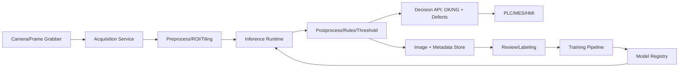

# AOI Computer Vision Learning Roadmap

面向对象：已经熟悉机器学习、NLP、LLM、模型部署和服务开发，希望进入 CV 与 AOI（Automated Optical Inspection，自动光学检测）方向，并具备独立完成需求理解、方案选型、训练优化、部署和服务架构设计的能力。

## 目标能力画像

完成路线后，你应该能独立回答并落地这些问题：

- 业务侧：缺陷是什么、漏检和误检哪个更贵、节拍和产线约束是什么、是否需要定位/分割/分级/追溯。
- 数据侧：如何设计采集方案、标注规范、golden sample、缺陷样本补齐、数据切分、防泄漏和线上漂移监控。
- 算法侧：分类、检测、分割、异常检测、传统视觉、规则算法、深度学习如何组合。
- 工程侧：如何从 PyTorch 导出 ONNX/TensorRT/OpenVINO，如何做批处理、ROI 裁剪、多相机同步、边缘部署和在线回传。
- 系统侧：如何设计产线 AOI 服务架构、模型版本管理、阈值管理、复判队列、数据闭环和灰度发布。

## 0. 先建立 AOI 问题框架（第 0 周）

AOI 不是“给一堆图片训练模型”这么简单，它通常是一个机器视觉系统：

- 光学系统：相机、镜头、光源、曝光、触发器、运动机构。
- 图像链路：采集、标定、畸变校正、配准、ROI、拼接、增强。
- 判定链路：规则算法、深度模型、阈值、后处理、缺陷归因。
- 产线链路：PLC/MES/工控机/边缘 GPU、节拍、报警、复判、追溯。

建议先做一页需求模板，任何 AOI 需求都按这个模板澄清：

- 产品与工序：检测对象、检测面、材质、尺寸、运动方式。
- 缺陷定义：划伤、脏污、异物、缺料、错位、毛刺、裂纹、色差、印刷不良等。
- 输出形态：OK/NG、缺陷类别、bbox、mask、面积/长度/位置、严重等级。
- 指标：漏检率、误检率、召回率、每类阈值、mAP、IoU、pixel/image AUROC、PRO、节拍。
- 工程约束：相机数量、分辨率、曝光、触发频率、延迟、吞吐、硬件、部署位置。
- 数据现状：正常样本数量、缺陷样本数量、标注粒度、是否有历史误判图。

## 1. CV 基础与工业图像处理（第 1-2 周）

你已有 ML/NLP 背景，所以重点不是从线性代数开始，而是补齐 CV 的图像工程直觉。

### 要掌握

- 图像表示：灰度/RGB/HSV/Lab，bit depth，动态范围，gamma，白平衡。
- 基础算子：滤波、边缘、形态学、阈值、连通域、轮廓、霍夫变换。
- 几何：相机内参/外参、畸变校正、透视变换、模板匹配、图像配准。
- 质量控制：模糊、过曝、欠曝、反光、阴影、噪声、视野偏移。

### 实战任务

- 用 OpenCV 写一个传统 AOI baseline：读取图片 -> ROI -> 光照归一化 -> 阈值/边缘/连通域 -> 输出缺陷候选区域。
- 做一次相机标定和畸变校正，理解像素到物理尺寸的关系。
- 对一组正常样本做均值图、方差图、差分图，体会“正常波动”对检测的影响。

### 推荐资料

- OpenCV camera calibration: https://docs.opencv.org/4.x/d4/d94/tutorial_camera_calibration.html
- OpenCV Python calibration: https://docs.opencv.org/4.x/dc/dbb/tutorial_py_calibration.html

## 2. 深度学习 CV 任务栈（第 3-4 周）

AOI 项目常见任务并不只有检测，选型要先看业务输出。

| 业务需求 | 常见建模任务 | 典型方法 |
| --- | --- | --- |
| 只判断 OK/NG | 分类 | ResNet/EfficientNet/ConvNeXt/ViT |
| 找缺陷位置 | 目标检测 | YOLO/Faster R-CNN/RT-DETR |
| 缺陷面积、边界、形态 | 语义/实例分割 | U-Net/DeepLab/Mask R-CNN/SAM 辅助标注 |
| 缺陷样本少，正常样本多 | 异常检测 | PatchCore/EfficientAD/PaDiM/STFPM/FastFlow |
| 高分辨率小缺陷 | 切图 + 多尺度检测/分割 | sliding window、ROI cascade、tiling |
| 尺寸/位置强约束 | 规则 + 模型混合 | 模板配准、几何测量、模型复核 |

### 要掌握

- CNN/Transformer 在视觉中的特征层级：边缘、纹理、局部结构、语义。
- 分类/检测/分割的数据格式、损失函数和指标。
- 高分辨率小目标：tile、overlap、feature stride、anchor/free anchor、FPN。
- 类别不均衡：focal loss、class weight、采样、hard example mining。
- 后处理：NMS、连通域、mask -> bbox、面积过滤、规则约束。

### 实战任务

- 用一个公开数据集训练分类 baseline。
- 用 YOLO 训练一个检测/分割模型，熟悉数据格式、增强、导出和推理。
- 用 U-Net 或 SegFormer 训练一个二分类缺陷分割模型。

### 推荐资料

- PyTorch transfer learning tutorial: https://docs.pytorch.org/tutorials/beginner/transfer_learning_tutorial.html
- Ultralytics YOLO docs: https://docs.ultralytics.com/

## 3. AOI 重点：视觉异常检测（第 5-6 周）

很多 AOI 场景缺陷样本稀缺、形态不可穷举，所以异常检测是核心能力之一。

### 三类主线

- 重构类：AutoEncoder/VAE/GAN，只用正常样本学习重构，异常处重构差。
- 特征距离类：PaDiM、PatchCore，用预训练特征建正常分布或 memory bank。
- Student-Teacher 类：STFPM、EfficientAD，让 student 学正常样本上的 teacher 表示。

### AOI 中的关键问题

- 正常样本不是单峰分布：批次差异、光照差异、位置偏差、材质纹理都会造成假阳性。
- 缺陷可能极小：需要高分辨率、局部特征、多尺度和强后处理。
- 缺陷可能是逻辑异常：比如顺序错、漏件、多件、装反，局部纹理正常但全局关系异常。
- 阈值不是一次性确定：需要按产品、工位、批次、缺陷成本做阈值策略。

### 实战任务

- 用 anomalib 在 MVTec AD 上跑 PatchCore 和 EfficientAD。
- 对同一个类别调不同阈值，画出 FPR/TPR、image-level 与 pixel-level 指标。
- 制造“光照变化/位移/轻微旋转”的测试集，观察误报来源。
- 把异常热力图转成 mask/bbox，并加入面积、长宽比、位置规则过滤。

### 推荐资料

- MVTec AD: https://www.mvtec.com/research-teaching/datasets/mvtec-ad
- MVTec AD 2: https://www.mvtec.com/research-teaching/datasets/mvtec-ad-2
- Anomalib docs: https://anomalib.readthedocs.io/en/v1/
- PatchCore paper page: https://www.amazon.science/publications/towards-total-recall-in-industrial-anomaly-detection
- EfficientAD paper page: https://huggingface.co/papers/2303.14535

## 4. 数据工程与标注闭环（第 7 周）

AOI 项目的上限经常由数据系统决定。

### 要掌握

- 数据采集协议：相机参数、光源参数、触发时间、工单、批次、设备号、判定结果。
- 数据切分：按时间/批次/设备/产品型号切分，避免同批次相似样本泄漏。
- 标注规范：缺陷类别、最小标注尺寸、边界原则、遮挡/反光/脏污处理。
- 数据版本：原图、增强图、ROI 图、标注、模型输入、预测结果要可追溯。
- 主动学习：收集低置信、阈值附近、人工复判样本进入下一轮训练。

### 实战任务

- 设计一个 AOI 数据目录结构和 metadata schema。
- 写一个数据 QA 脚本：分辨率、通道、坏图、重复图、标注越界、类别分布。
- 建立 hard negative 集合：误报正常图、边界样本、光照异常但非缺陷样本。

## 5. 训练优化与评估（第 8-9 周）

### 要掌握

- 训练策略：迁移学习、冻结/解冻、学习率调度、warmup、EMA、early stopping。
- 增强策略：亮度/对比度/噪声/模糊/旋转/透视/cutmix/mosaic，区分“真实扰动”和“破坏语义”。
- 小样本策略：few-shot、异常检测、合成缺陷、copy-paste、promptable segmentation 辅助标注。
- 指标体系：分类 confusion matrix，检测 mAP，分割 IoU/Dice，异常检测 image/pixel AUROC、PRO。
- 产线指标：漏检率、误检率、复判率、节拍、停线成本、每批次漂移。

### 评估原则

- 离线测试集要包含时间外样本、批次外样本、设备外样本。
- 缺陷检测要同时看 image-level 与 region/pixel-level。
- 高召回场景不要只报 mAP，要明确每类漏检样本。
- 阈值应作为可配置资产管理，而不是写死在代码里。

### 实战任务

- 建立一个实验表：数据版本、模型版本、输入尺寸、增强、指标、延迟、结论。
- 为一个模型做 ablation：输入尺寸、tile overlap、阈值、后处理参数。
- 输出一份“上线评审报告”：指标、失败样例、风险、回滚方案。

## 6. 推理部署与性能优化（第 10 周）

### 要掌握

- 导出链路：PyTorch -> ONNX -> ONNX Runtime/TensorRT/OpenVINO。
- 图优化：算子融合、静态 shape、batch、FP16/INT8、校准集。
- 边缘部署：工控机、Jetson、Intel CPU/iGPU、GPU server。
- 性能指标：P50/P95/P99 latency、throughput、显存、冷启动、预处理/后处理耗时。
- 工业现场约束：断网可运行、本地缓存、模型热更新、日志回传、失败降级。

### 推荐资料

- ONNX Runtime performance tuning: https://onnxruntime.ai/docs/performance/tune-performance/
- NVIDIA TensorRT docs: https://docs.nvidia.com/tensorrt/index.html
- TensorRT quantization: https://docs.nvidia.com/deeplearning/tensorrt/10.13.2/inference-library/work-quantized-types.html
- OpenVINO Model Server: https://docs.openvino.ai/2025/openvino-workflow/model-server/ovms_what_is_openvino_model_server.html

### 实战任务

- 导出一个 YOLO/分割/异常检测模型到 ONNX。
- 分别用 ONNX Runtime CPU/GPU、TensorRT 或 OpenVINO 跑 benchmark。
- 把预处理、模型推理、后处理拆开计时，找瓶颈。
- 做一次 FP16 或 INT8 尝试，比较精度与延迟变化。

## 7. AOI 服务架构设计（第 11 周）

### 推荐架构

### 服务模块

- Acquisition Service：相机触发、帧缓存、图像质量检查。
- Preprocess Service：标定、畸变校正、ROI、tile、归一化。
- Inference Runtime：模型加载、动态 batch、多模型路由、GPU/CPU 资源隔离。
- Postprocess Service：阈值、规则、mask/bbox 过滤、坐标还原。
- Decision API：统一输出 OK/NG、缺陷列表、置信度、位置、版本号。
- Review System：人工复判、标注、原因归档。
- Data Loop：自动采样、hard negative、漂移监控、训练数据构建。
- Model Registry：模型版本、配置、阈值、依赖、回滚。

### 设计原则

- 模型输出和业务判定分离：模型给 score/mask/bbox，规则层做业务阈值。
- 阈值和后处理配置化：按产品、工位、型号、缺陷类别管理。
- 每次判定可追溯：原图、输入图、模型版本、配置版本、推理结果、人工复判。
- 边缘优先自治：产线断网时仍能运行，联网后同步数据。
- 服务接口稳定：换模型不影响 PLC/MES/HMI 的调用协议。

## 8. 综合项目（第 12 周）

做一个端到端 mini AOI 项目，目标是从需求到部署跑通。

### 题目

基于 MVTec AD 或 MVTec AD 2，完成一个缺陷检测服务：

- 训练：选择 PatchCore/EfficientAD 或 YOLO/分割模型。
- 评估：输出 image-level 和 pixel-level 指标，整理失败样例。
- 部署：导出 ONNX，提供 REST/gRPC 推理接口。
- 架构：支持模型版本、阈值配置、结果落库、复判样本导出。
- 文档：写一份上线说明，包括指标、延迟、风险和回滚。

### 验收标准

- 能解释为什么选这个模型，而不是只说效果好。
- 能说明误报/漏报的主要来源。
- 能给出数据闭环方案。
- 能在本地或边缘设备稳定运行推理服务。
- 能面向业务方讲清“上线后如何维护”。

## 12 周节奏总览

| 周 | 主题 | 产出 |
| --- | --- | --- |
| 0 | AOI 需求框架 | 需求澄清模板 |
| 1-2 | OpenCV 与工业图像处理 | 传统视觉 baseline |
| 3-4 | 分类/检测/分割 | YOLO/U-Net baseline |
| 5-6 | 异常检测 | PatchCore/EfficientAD 实验 |
| 7 | 数据工程 | 数据 QA 与标注规范 |
| 8-9 | 训练优化与评估 | 实验报告与上线评审 |
| 10 | 推理部署 | ONNX/TensorRT/OpenVINO benchmark |
| 11 | 服务架构 | AOI 服务架构设计 |
| 12 | 综合项目 | 端到端 AOI demo |

## 你已有背景的迁移建议

- NLP/LLM 的 embedding 检索直觉，可以迁移到 PatchCore 这类特征 memory bank 方法。
- LLM 服务经验，可以迁移到模型网关、版本管理、灰度发布、观测和回滚。
- 机器学习经验，可以迁移到数据切分、防泄漏、指标设计、错误分析。
- 需要新增的主要是图像采集、光学、标定、像素级标注、高分辨率推理和产线节拍意识。

